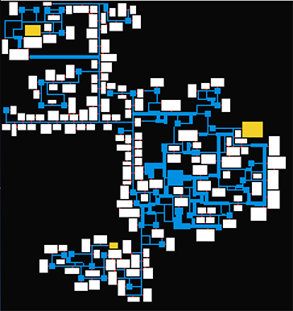

# level-generator
Randomly generate 2d levels in closed environments, as found in many roguelike games.




* yellow rectangles are predefined rooms
* blue rectangles are generated corridors
* white rectangles are generated rooms
* red squares are doors

This module procedurally generates 2d levels in closed environments, as found in many roguelike games.

Levels are built by specifying tunnelers, which are agents that cut through the closed spaces, building corridors (tunnels,) anterooms, rooms, and doors along the way. The construction process uses a design file, which specifies the various tweakable parameters.

Though it is built with top-down perspective in mind, it may be useful for other perspectives like side-scrollers too.


## credit and inspiration
based on this blog entry http://www.gridsagegames.com/blog/2014/06/procedural-map-generation/ which references dungeonmaker for it's tunneling algorithms.

The algorithms in this module are conceptually based on dungeonmaker, though none of it's code was used.  http://dungeonmaker.sourceforge.net/DM2_Manual/


## install

```bash
npm install level-generator
```

## usage

```javascript
import LevelGenerator from 'level-generator'


level = new LevelGenerator()

built = false

while (!built) {
  built = level.buildStep()
}

// level.objects now has all of the rooms, tunnels, anterooms, and doors

```

You can also pass in a design object, which will alter the way levels are constructed:

```javascript
const design = { ... }
const level = new LevelGenerator(design)
```

look at `design-default.js` to see the default design settings to get an idea of how to modify this.
